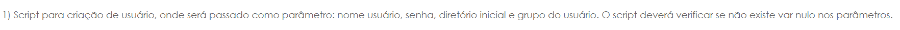
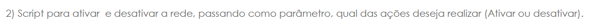
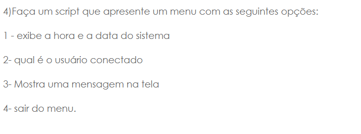
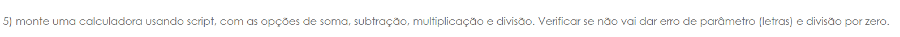
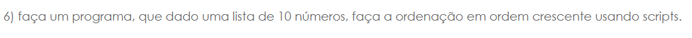
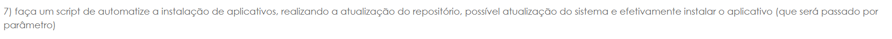
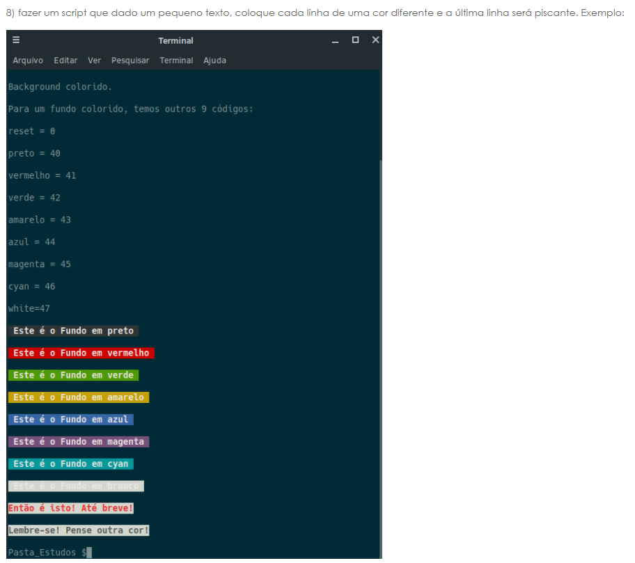
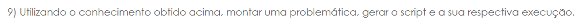

## Exercícios Shell Script :desktop_computer: 
Este repositório contém alguns exercícios de shell script passados em sala de aula na matéria de SISTEMAS OPERACIONAIS II.
### :white_medium_square: Exercício 1
  

### :white_medium_square: Exercício 2
  

### :white_medium_square: Exercício 3
  

### :white_medium_square: Exercício 4
  

### :white_medium_square: Exercício 5
  

### :white_medium_square: Exercício 6
  

### :white_medium_square: Exercício 7
  

### :white_medium_square: Exercício 8
  

### :white_medium_square: Exercício 9
  
